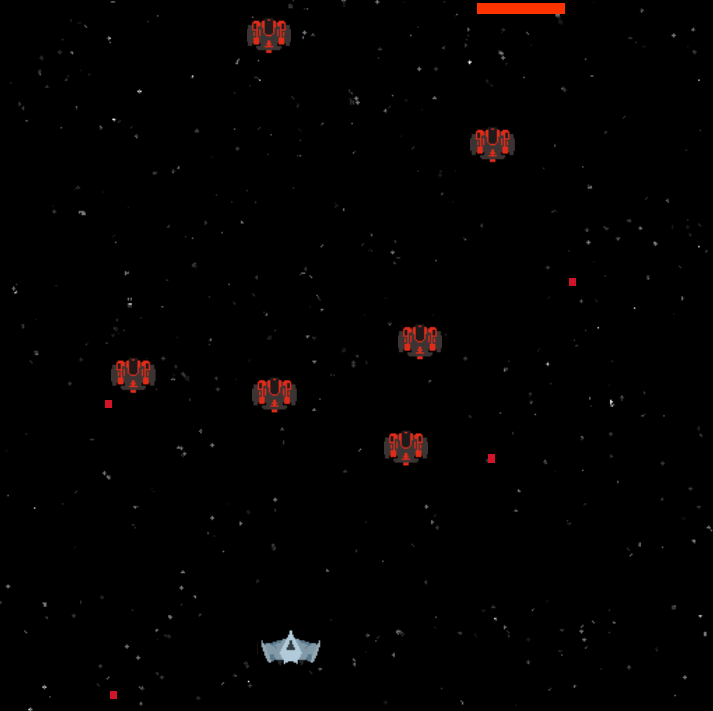

# PixiJs.galaguh

<h3>Try it live at:</h3>
https://ryemoss.github.io/PixiJs.galaguh/
<h5>Controls</h5>
<ul>
  <li>A, D: move left, right</li>
  <li>Spacebar: fire</li>
</ul>
  

A simple project made using PixiJS. 
It is a modification of the example PixiJS project found here:

https://github.com/kittykatattack/learningPixi

<h5>Game Screenshot</h5>

